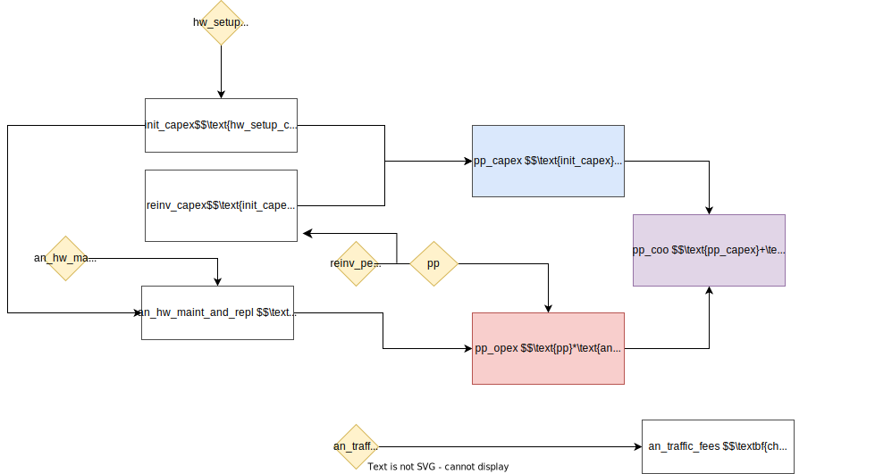

# Costs

## Overview

The CostModel class calculates deployment and operational costs for telecommunications infrastructure. It provides cost analysis for multiple technology options (fiber, cellular, point-to-point, satellite, and electricity) to support infrastructure planning decisions, computing capital expenditures (CAPEX), operational expenditures (OPEX), and operator revenue projections for each technology option.

**Key features:**

- Multi-technology cost analysis (fiber, cellular, point-to-point, satellite, electricity)
- Capital expenditure (CAPEX) calculations including equipment and installation costs
- Operational expenditure (OPEX) calculations including maintenance and traffic fees
- Operator revenue projections based on throughput requirements
- Cost of ownership analysis over multiple time periods
- Per-POI cost breakdowns for detailed planning

## Class Parameters

| Parameter | Type | Default | Description |
|-----------|------|---------|-------------|
| primary_tech_params | `pd.DataFrame` | Required | DataFrame containing technology parameters with columns 'Variable name' and 'Value'. Must include all parameters defined in get_required_keys() |
| logger | `logging.Logger` | `None` | Logger instance for logging messages |
| expansion_factor | `float` | `1.1` | Factor to increase the amount of fiber line required by 10% (or other amount) |

**Example of `primary_tech_params` input**

| Technology | Parameter | Variable name | Value | Measurement unit |
|------------|-----------|---------------|-------|------------------|
| fiber | On-premises hardware setup cost​ (materials, equipment, labor) | hw_setup_cost_fiber | 500 | USD per school​ |
| fiber | Fiber optical cable line​ construction cost (materials, equipment, labor) | focl_constr_cost_fiber | 8000 | USD per km​ |
| fiber | Hardware refresh after | reinv_period_fiber | 5 | Years |
| fiber | Annual hardware maintenance and replacement costs​ | an_hw_maint_and_repl_fiber | 0.1 | USD per year​ (as a fraction of hardware CapEx​) |
| fiber | Annual transit bandwidth cost for 1 Mbps of dedicated internet access channel over a fiber optic cable line | an_traffic_fees_one_mbps_fiber | 12 | USD per Mbps per year |
| fiber | Annual access bandwidth cost for 1 Mbps of dedicated internet access channel over a fiber optic cable line | an_isp_fees_one_mbps_fiber | 31.8 | USD per Mbps per year |
| fiber | Time required to install fiber infrastructure | invest_time_fiber | 0 | Years |
| p2area | On-premises hardware setup cost​ (materials, equipment, labor) | hw_setup_cost_p2area | 80 | USD per school​ |
| p2area | Reinvest into hardware after | reinv_period_p2area | 3 | Years |
| p2area | Annual hardware maintenance and replacement costs​ | an_hw_maint_and_repl_p2area | 0.1 | USD per year​ (as a fraction of hardware CapEx​) |
| p2area | Annual Traffic fee for 1 Mbps of dedicated internet access channel over cellular network | an_traffic_fees_one_mbps_p2area | 12 | USD per Mbps per year |
| p2area | Annual ISP fee for 1 Mbps of dedicated internet access channel over cellular network | an_isp_fees_one_mbps_p2area | 24 | USD per Mbps per year |
| p2area | Time required to install cellular infrastructure | invest_time_p2area | 0 | Years |
| p2p | On-premises hardware setup cost​ (materials, equipment, labor) | hw_setup_cost_p2p | 500 | USD per school​ |
| p2p | Microwave point-to-point access link installation and comissioning cost (materials, equipment, labor) | access_link_setup_p2p | 831.59 | USD per hop​ |
| p2p | Number of microwave point-to-point backhaul links | backhaul_link_num_p2p | 0 | Links |
| p2p | Microwave point-to-point backhaul link installation and comissioning cost (materials, equipment, labor) | backhaul_link_setup_p2p | 2825.07 | USD per hop​ |
| p2p | Number of retransmission telecommunication towers | retr_tower_num_p2p | 0 | Towers |
| p2p | Retransmission telecommunication tower installation cost | retr_tower_inst_p2p | 13000 | USD per tower |
| p2p | Bandwidth per access link | access_link_bandwidth_p2p | 10 | MHz |
| p2p | Bandwidth per backhaul link | backhaul_link_bandwidth_p2p | 20 | MHz |
| p2p | One time license fee for 1MHz | one_time_license_fee_1mhz_p2p | 500 | USD per MHz |
| p2p | Reinvest into hardware after | reinv_period_p2p | 5 | Years |
| p2p | Annual hardware maintenance and replacement costs​ | an_hw_maint_and_repl_p2p | 0.004 | USD per year​ (as a fraction of hardware CapEx​) |
| p2p | Annual recurring license fee for 1MHz | an_license_fee_1mhz_p2p | 100 | USD per MHz per year |
| p2p | Annual Traffic fee for 1 Mbps of dedicated internet access channel over a P2P microwave link | an_traffic_fees_one_mbps_p2p | 12 | USD per Mbps per year |
| p2p | Annual ISP fee for 1 Mbps of dedicated internet access channel over a P2P microwave link | an_isp_fees_one_mbps_p2p | 24 | USD per Mbps per year |
| p2p | Time required to install P2P infrastructure | invest_time_p2p | 0 | Years |
| satellite | On-premises hardware setup cost​ (materials, equipment, labor) | hw_setup_cost_sat | 3000 | USD per school​ |
| satellite | Reinvest into hardware after | reinv_period_sat | 5 | Years |
| satellite | Annual hardware maintenance and replacement costs​ | an_hw_maint_and_repl_sat | 0.04 | USD per year​ (as a fraction of hardware CapEx​) |
| satellite | Annual Traffic fee for 1 Mbps of dedicated internet access channel over satellite channel | an_traffic_fees_one_mbps_sat | 12 | USD per Mbps per year |
| satellite | Annual ISP fee for 1 Mbps of dedicated internet access channel over satellite channel | an_isp_fees_one_mbps_sat | 24 | USD per Mbps per year |
| satellite | Time required to install satellite infrastructure | invest_time_sat | 0 | Years |
| Electricity | On-premises hardware setup cost​ (materials, equipment, labor) | hw_setup_cost_electricity | 0 | USD per school​ |
| Electricity | Reinvest into hardware after | reinv_period_electricity | 1 | Years |
| Electricity | Annual hardware maintenance and replacement costs​ | an_hw_maint_and_repl_electricity | 0 | USD per year​ (as a fraction of hardware CapEx​) |
| Finance | Interest rate | interest_rate | 0.02 | Percentage |
| Overall | Project planning period | pp | 10 | Years |

## Class Attributes

| Attribute | Type | Description |
|-----------|------|-------------|
| primary_tech_params | `pd.DataFrame` | DataFrame containing technology parameters |
| expansion_factor | `float` | Factor for expanding fiber optic cable length in calculations |
| logger | `logging.Logger` | Logger instance for logging messages |

## Methods

| Method | Return Type | Description |
|--------|-------------|-------------|
| get_required_keys() | `list` | Returns list of required parameter names for cost calculations |
| validate_inputs(primary_tech_params) | `None` | Validates the input parameters |
| compute_fiber_costs(poi_num, ch_throughput, focl_length_fiber, pp) | `pd.DataFrame` | Calculates fiber network deployment costs |
| compute_p2area_costs(poi_num, ch_throughput, pp) | `pd.DataFrame` | Calculates cellular (point-to-area) network deployment costs |
| compute_p2p_costs(poi_num, ch_throughput, pp) | `pd.DataFrame` | Calculates point-to-point network deployment costs |
| compute_satellite_costs(poi_num, ch_throughput, pp) | `pd.DataFrame` | Calculates satellite network deployment costs |
| compute_electricity_costs(poi_num, pp) | `pd.DataFrame` | Calculates electricity costs |
| perform_analysis(poi_data) | `pd.DataFrame` | Computes POI-level costs across all technology options for a given dataset |

The cost calculation methods (`compute_fiber_costs`, `compute_p2area_costs`, `compute_p2p_costs`, `compute_satellite_costs`, `compute_electricity_costs`) each produce a `pd.DataFrame` output with the following keys:

- `technology`: The technology type being analyzed (in this example "satellite", but could also be fiber, p2area, p2p, or electricity)
- `number_poi`: Number of points of interest (POIs) included in this calculation
- `ch_throughput`: Channel throughput in Mbps (megabits per second)
- `pp`: Planning period in years - the time horizon for the analysis
- `pp_profit`: Total profit over the entire planning period - calculated as revenue minus cost of ownership
- `pp_profit_per_poi`: Average profit per POI over the entire planning period
- `pp_revenue`: Total revenue generated over the entire planning period
- `pp_revenue_per_poi`: Average revenue per POI over the entire planning period
- `pp_coo`: Total cost of ownership over the entire planning period (includes both CAPEX and OPEX)
- `pp_coo_per_poi`: Average cost of ownership per POI over the entire planning period
- `init_capex`: Initial capital expenditure - the upfront investment required to deploy the technology
- `annual_revenue`: Average annual revenue (calculated as total planning period revenue divided by number of years)
- `annual_revenue_per_poi`: Average annual revenue per POI
- `annual_cost`: Average annual cost (includes CAPEX and OPEX)
- `annual_cost_per_poi`: Average annual cost per POI - a key metric for comparing the cost-effectiveness of different technologies

The method `perform_analysis(poi_data)` should be provided with an input DataFrame with the following columns:

- `poi_id`: unique identifier (UUID)
- `total_mbps`: total throughput in Mbps for each POI (estimated using the Demand module of the toolkit)
- `upstream_node_distance`: distance to the nearest transmission node (or connected POI) according the the FiberPath solution. This is the additional length of fiber required to connect the POI to the fiber network.
- `has_electricity`: whether the POI is already electrified or not (`bool`).

| poi_id | total_mbps | upstream_node_distance | has_electricity |
|--------|------------|------------------------|----------------|
| 09b90515-0ecc-4992-9d39-ae208e1c1fea | 415 | 0 | True |
| 0c16c2e8-db92-411b-a6f7-535fb1810e34 | 1210 | 0 | True |
| 1205e5ef-5d91-47b7-8fc0-11ef019263e5 | 7640 | 1682.919	 | True |
| 1534adf8-b45c-443b-8e1d-87a504e6dc64 | 865 | 1887.719 | True |
| 192c1704-9e7e-4b7a-8ba7-0eed5ae771ad | 79410 | 906.343 | True |

The output is structured as a multi-indexed pandas DataFrame with the following index levels:

- `poi_id`: Unique identifier for each point of interest
- `pp`: Planning period (year number from 1 to the total project planning period)
- `technology`: Technology type (fiber, p2area, p2p, satellite, electricity)
- `metric`: Cost metric (e.g., pp_profit, annual_cost_per_poi, pp_revenue, etc.)

The `value` column contains the actual numerical results for each combination of indices.

## Summary of cost models

### Fiber

_Table. Fiber cost model parameters._

| Technology | Parameter | Variable name | Value | Measurement unit |
|------------|-----------|---------------|-------|------------------|
| fiber | On-premises hardware setup cost​ (materials, equipment, labor) | hw_setup_cost_fiber | 500 | USD per school​ |
| fiber | Fiber optical cable line​ construction cost (materials, equipment, labor) | focl_constr_cost_fiber | 8000 | USD per km​ |
| fiber | Hardware refresh after | reinv_period_fiber | 5 | Years |
| fiber | Annual hardware maintenance and replacement costs​ | an_hw_maint_and_repl_fiber | 0.1 | USD per year​ (as a fraction of hardware CapEx​) |
| fiber | Annual transit bandwidth cost for 1 Mbps of dedicated internet access channel over a fiber optic cable line | an_traffic_fees_one_mbps_fiber | 12 | USD per Mbps per year |
| fiber | Annual access bandwidth cost for 1 Mbps of dedicated internet access channel over a fiber optic cable line | an_isp_fees_one_mbps_fiber | 31.8 | USD per Mbps per year |

_Figure. Fiber cost model._


### Cellular

_Table. Cellular cost model parameters._

| Technology | Parameter | Variable name | Value | Measurement unit |
|------------|-----------|---------------|-------|------------------|
| p2area | On-premises hardware setup cost​ (materials, equipment, labor) | hw_setup_cost_p2area | 80 | USD per school​ |
| p2area | Reinvest into hardware after | reinv_period_p2area | 3 | Years |
| p2area | Annual hardware maintenance and replacement costs​ | an_hw_maint_and_repl_p2area | 0.1 | USD per year​ (as a fraction of hardware CapEx​) |
| p2area | Annual Traffic fee for 1 Mbps of dedicated internet access channel over cellular network | an_traffic_fees_one_mbps_p2area | 12 | USD per Mbps per year |
| p2area | Annual ISP fee for 1 Mbps of dedicated internet access channel over cellular network | an_isp_fees_one_mbps_p2area | 24 | USD per Mbps per year |
| p2area | Time required to install cellular infrastructure | invest_time_p2area | 0 | Years |

_Figure. Cellular cost model._



### Point-to-point microwave

_Table. Point-to-point microwave cost model parameters._

| Technology | Parameter | Variable name | Value | Measurement unit |
|------------|-----------|---------------|-------|------------------|
| p2p | On-premises hardware setup cost​ (materials, equipment, labor) | hw_setup_cost_p2p | 500 | USD per school​ |
| p2p | Microwave point-to-point access link installation and comissioning cost (materials, equipment, labor) | access_link_setup_p2p | 831.59 | USD per hop​ |
| p2p | Number of microwave point-to-point backhaul links | backhaul_link_num_p2p | 0 | Links |
| p2p | Microwave point-to-point backhaul link installation and comissioning cost (materials, equipment, labor) | backhaul_link_setup_p2p | 2825.07 | USD per hop​ |
| p2p | Number of retransmission telecommunication towers | retr_tower_num_p2p | 0 | Towers |
| p2p | Retransmission telecommunication tower installation cost | retr_tower_inst_p2p | 13000 | USD per tower |
| p2p | Bandwidth per access link | access_link_bandwidth_p2p | 10 | MHz |
| p2p | Bandwidth per backhaul link | backhaul_link_bandwidth_p2p | 20 | MHz |
| p2p | One time license fee for 1MHz | one_time_license_fee_1mhz_p2p | 500 | USD per MHz |
| p2p | Reinvest into hardware after | reinv_period_p2p | 5 | Years |
| p2p | Annual hardware maintenance and replacement costs​ | an_hw_maint_and_repl_p2p | 0.004 | USD per year​ (as a fraction of hardware CapEx​) |
| p2p | Annual recurring license fee for 1MHz | an_license_fee_1mhz_p2p | 100 | USD per MHz per year |
| p2p | Annual Traffic fee for 1 Mbps of dedicated internet access channel over a P2P microwave link | an_traffic_fees_one_mbps_p2p | 12 | USD per Mbps per year |
| p2p | Annual ISP fee for 1 Mbps of dedicated internet access channel over a P2P microwave link | an_isp_fees_one_mbps_p2p | 24 | USD per Mbps per year |
| p2p | Time required to install P2P infrastructure | invest_time_p2p | 0 | Years |

_Figure. Point-to-point microwave cost model._


### Satellite

_Table. Satellite cost model parameters._

| Technology | Parameter | Variable name | Value | Measurement unit |
|------------|-----------|---------------|-------|------------------|
| satellite | On-premises hardware setup cost​ (materials, equipment, labor) | hw_setup_cost_sat | 3000 | USD per school​ |
| satellite | Reinvest into hardware after | reinv_period_sat | 5 | Years |
| satellite | Annual hardware maintenance and replacement costs​ | an_hw_maint_and_repl_sat | 0.04 | USD per year​ (as a fraction of hardware CapEx​) |
| satellite | Annual Traffic fee for 1 Mbps of dedicated internet access channel over satellite channel | an_traffic_fees_one_mbps_sat | 12 | USD per Mbps per year |
| satellite | Annual ISP fee for 1 Mbps of dedicated internet access channel over satellite channel | an_isp_fees_one_mbps_sat | 24 | USD per Mbps per year |

_Figure. Satellite cost model._


## Example

```python
import pandas as pd
from giga_inframapkit.entities.pointofinterest import PointOfInterestCollection
from giga_inframapkit.costmodel.costs import CostModel

# 1. Set up your data collections

# Points of Interest
poi_df = pd.read_csv("input/points_of_interest.csv")
poi_df = poi_df[["poi_id", "has_electricity"]]
# Add columns 'total_mbps', 'upstream_node_distance' with random values
poi_df['total_mbps'] = np.random.randint(10, 100, size=len(poi_df))
poi_df['upstream_node_distance'] = np.random.uniform(100, 10000, size=len(poi_df)).round(3)

# Microeconomic inputs (e.g. cost per km of fiber)
cost_inputs_df = pd.read_csv("input/cost_inputs.csv")
cost_inputs_df.head()

# 	Variable name	Value
# 0	hw_setup_cost_fiber	500.0
# 1	focl_constr_cost_fiber	8000.0
# 2	reinv_period_fiber	5.0
# 3	an_hw_maint_and_repl_fiber	0.1
# 4	an_traffic_fees_one_mbps_fiber	12.0

# 2. Create a FiberPath analysis instance

costmodel = CostModel(cost_inputs_df, logger=None)

# 3. Run the analysis

all_costs = costmodel.perform_analysis(poi_df)
all_costs.head()

# 				value
# poi_id	pp	technology	metric	
# 09b90515-0ecc-4992-9d39-ae208e1c1fea	1	fiber	pp_profit	4430.0
# 0c16c2e8-db92-411b-a6f7-535fb1810e34	1	fiber	pp_profit	13970.0
# 1205e5ef-5d91-47b7-8fc0-11ef019263e5	1	fiber	pp_profit	74839.3
# 1534adf8-b45c-443b-8e1d-87a504e6dc64	1	fiber	pp_profit	-8443.1
# 192c1704-9e7e-4b7a-8ba7-0eed5ae771ad	1	fiber	pp_profit	943596.6
```