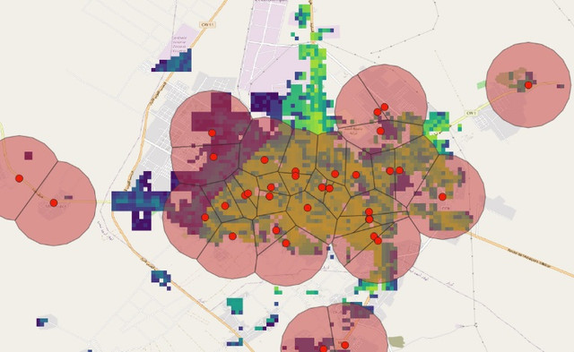

# Demand

## Overview

The Demand class analyzes population density and bandwidth requirements around points of interest (POIs). It calculates population counts within specified radii and estimates network traffic demand based on general population density.

_Figure. Population counts around Points of Interest using non-overlapping buffers._



**Key features:**

- Calculates population distribution within customizable radii around POIs
- Estimates bandwidth requirements based on population and per-user demand
- Supports non-overlapping catchment areas using Voronoi diagrams

## Class Parameters

### Required

- **points_of_interest** (`PointOfInterestCollection`): Collection of points of interest for analysis.
- **population_data_handler** (`PopulationDataHandler`): Handler for accessing population data.

## Optional

- **radii** (`list`, default=[1, 3, 5]): List of radii in kilometers for population analysis.
- **radius_for_demand** (`int`, default=1): Specific radius used for traffic demand calculations.
- **mbps_demand_per_user** (`int`, default=5): Throughput required per user in Mbps.
- **overlap_allowed** (`bool`, default=False): Whether to allow POI catchment areas to overlap.
- **logger** (`logging.Logger`, optional): Logger instance. Default created if None.

## Class Attributes

- **points_of_interest**: Collection of points of interest
- **population_data_handler**: Handler for population data
- **population_data**: Population dataset from the handler
- **radii**: List of radii for analysis
- **radius_for_demand**: Radius used for traffic calculations
- **mbps_demand_per_user**: Throughput required demand per user
- **overlap_allowed**: Boolean flag for catchment area overlap
- **analysis_param**: Dictionary of analysis parameters
- **analysis_stats**: Dictionary of analysis statistics
- **analysis_results**: Dictionary of raw analysis results
- **traffic_demand**: DataFrame of bandwidth requirements per POI

## Methods

- **perform_analysis()**: Executes demand analysis based on population distribution around POIs.
- **get_results_table()**: Returns formatted results including traffic demand estimates.
- **get_storage_table()**: Returns raw analysis data.
- **format_analysis_summary()**: Returns a human-readable summary of analysis statistics.

## Example

```python
import pandas as pd
from giga_inframapkit.entities.pointofinterest import PointOfInterestCollection
from giga_inframapkit.handlers.populationdatahandler import PopulationDataHandler
from giga_inframapkit.mapping.demand import Demand

# 1. Set up your data collections

poi_df = pd.read_csv("input/points_of_interest.csv")
poi_collection = PointOfInterestCollection()
poi_collection.load_from_records(poi_df.to_dict('records'))

# PointOfInterestCollection: 100 entities

# 2. Set up the population data handler, that downloads a raster file with population data into the data_dir - It has a method called population_data, that loads a GeoDataFrame with the values per pixel

pop_handler = PopulationDataHandler(
    data_dir="input/population_data",
    country_code="ESP",
    dataset_year=2020,
    one_km_res=True,
    un_adjusted=True
)

# 3. Create a Demand analysis instance

demand = Demand(
    points_of_interest = poi_collection,
    population_data_handler = pop_handler,
    radii = [1, 2, 3],
    logger = None,
    overlap_allowed = False,
    mbps_demand_per_user = 5)

# 3. Run the analysis

demand.perform_analysis()

# Demand Analysis Summary:
# Number of points of interest: 100
# Country population count: 46754784.0
# Mean population count of 1km area around a point of interest: 968.88
# Median population count of 1km area around a point of interest: 231.0
# Sum population count of 1km area around a point of interest: 96888
# Mean point of interest count of 1km area around a point of interest: 1.54
# Median point of interest count of 1km area around a point of interest: 1.0
# Sum point of interest count of 1km area around a point of interest: 154
# Mean population count of 2km area around a point of interest: 3164.57
# Median population count of 2km area around a point of interest: 1294.0
# Sum population count of 2km area around a point of interest: 316457
# Mean point of interest count of 2km area around a point of interest: 2.98
# Median point of interest count of 2km area around a point of interest: 3.0
# Sum point of interest count of 2km area around a point of interest: 298
# Mean population count of 3km area around a point of interest: 6401.05
# Median population count of 3km area around a point of interest: 3368.0
# Sum population count of 3km area around a point of interest: 640105
# Mean point of interest count of 3km area around a point of interest: 5.2
# Median point of interest count of 3km area around a point of interest: 5.0
# Sum point of interest count of 3km area around a point of interest: 520
# Time taken for analysis: 0.7 seconds

demand.get_results_table()

# 	poi_id	population	poi_count	number_of_users	total_mbps
# 0	23dd6a45-3656-435b-b3b1-c16efab9daeb	{'population_1km': 377, 'population_2km': 2850...	{'poi_count_1km': 1, 'poi_count_2km': 4, 'poi_...	377	1885
# 1	e13a657c-edf0-4013-92db-6c70136e3ac9	{'population_1km': 64, 'population_2km': 457, ...	{'poi_count_1km': 2, 'poi_count_2km': 6, 'poi_...	64	320
# 2	de75c87b-2676-47be-8454-4c44c4e6f644	{'population_1km': 132, 'population_2km': 662,...	{'poi_count_1km': 2, 'poi_count_2km': 3, 'poi_...	132	660
# 3	4267fc81-0e9f-40ca-84c8-84529958dc22	{'population_1km': 233, 'population_2km': 3626...	{'poi_count_1km': 1, 'poi_count_2km': 3, 'poi_...	233	1165
# 4	ae0ccc6e-5f91-4a58-a60b-68e8ebcdc797	{'population_1km': 737, 'population_2km': 4656...	{'poi_count_1km': 2, 'poi_count_2km': 7, 'poi_...	737	3685
```