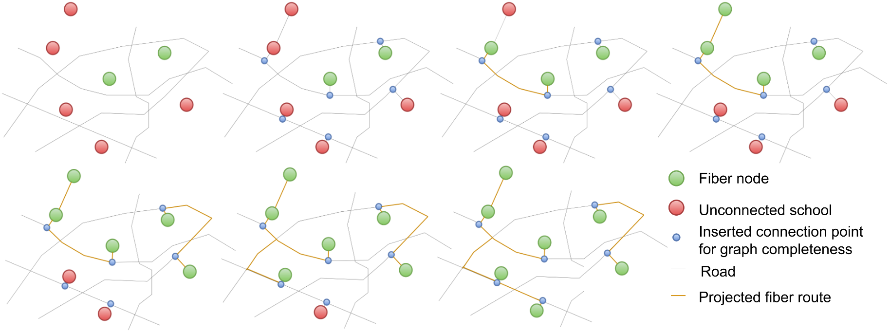

# Fiber Path

## Overview

The fiber path model identifies the shortest and most cost-effective paths for connecting unconnected points of interest (POIs) to the existing optical fiber network using the road network. By minimizing the total length of fiber required, this model reduces overall deployment costs while efficiently extending connectivity.

To start with, the model connects POIs and fiber nodes to the existing road network using straight lines (unless they are already on the road network). Then, for each unconnected POI, it computes the shortest path to all fiber nodes. POIs that are already connected to the fiber network can also act as fiber nodes, from which the fiber network can be extended.

_Figure: Graph initialization and fiber path algorithm_



At each step of the algorithm, new connections are made between connected and unconnected points as long as the length of the new connection is below a specified threshold. For example, it can be specified that no single fiber line should be longer than 5 kilometers.

This approach enables economies of scale: POIs can act as relay points for neighboring POIs, enabling connectivity without each one needing to connect directly to a transmission node. This approach optimizes resource usage and simplifies network expansion.

In practice, this model is an application of [Kruskal's algorithm](https://en.wikipedia.org/wiki/Kruskal%27s_algorithm) to find a Minimum Spanning Tree (MST) in a network graph, where the edges are the road network and the vertices are POIs and fiber nodes. The MST ensures the minimal fiber path necessary to connect all relevant points while adhering to road network constraints related to distance.

_Figure: Output of fiber path algorithm_


**Key features:**

- Plans optimal fiber paths using road networks or direct line-of-sight connections
- Supports clustering analysis for faster computations and regional planning
- Incorporates scale economies, allowing POIs to connect to other connected POIs
- Optimizes based on physical distance or operator profits (thus findings the paths that connect all POIs, while maximizing the potential revenue by laying down fiber through the most populous zones)

## Class Parameters

| Parameter | Type | Default | Description |
|-----------|------|---------|-------------|
| points_of_interest | `PointOfInterestCollection` | Required | Collection of points of interest to be connected |
| transmission_nodes | `TransmissionNodeCollection` | Required | Collection of transmission infrastructure nodes to connect to |
| max_connection_distance | `int` | Required | Maximum connection distance in meters using the selected distance_metric |
| use_road_data | `bool` | Required | If True, use road networks; if False, use direct line-of-sight |
| scale_economies | `bool` | `True` | If True, POIs can connect to other connected POIs; if False, POIs can only connect to transmission nodes |
| n_clusters | `int` | `None` | Number of clusters for analysis. If None, clustering is based on distance. If 1, no clustering is performed |
| constrained | `bool` | `False` | If True, each cluster must contain at least one transmission node |
| network_type | `str` | `'all'` | Road network type ('all', 'bike', 'walk', etc.) |
| random_state | `int` | `0` | Seed for random operations |
| distance_metric | `str` | `'length'` | Metric to optimize: 'length' (physical distance) or 'net_cost' (cost minus revenue) |
| revenue_per_pop | `int` | `10` | Estimated revenue per person along the fiber path |
| fiber_cost_per_km | `int` | `5` | Cost of fiber per kilometer |
| population_handler | `PopulationDataHandler` | `None` | Required for net_cost distance metric |
| logger | `Logger` | `None` | Logger instance for capturing messages. If None, a default logger will be created |

## Class Attributes

| Attribute | Type | Description |
|-----------|------|-------------|
| points_of_interest | `PointOfInterestCollection` | Original collection of POIs |
| transmission_nodes | `TransmissionNodeCollection` | Original collection of transmission nodes |
| all_collection | `EntityCollection` | Combined collection of POIs and transmission nodes |
| max_connection_distance | `int` | Maximum allowed connection distance |
| use_road_data | `bool` | Flag indicating whether to use road data or line-of-sight |
| scale_economies | `bool` | Flag indicating whether POIs can connect to other connected POIs |
| n_clusters | `int` | Number of clusters for analysis |
| distance_metric | `str` | Metric used for optimization |
| analysis_param | `dict` | Dictionary storing configuration parameters |
| analysis_stats | `dict` | Dictionary storing statistics (counts, lengths, times) |
| fiber_path_dict | `dict` | Dictionary storing path information for each POI |
| fiber_path_nodes | `DataFrame` | DataFrame containing nodes in the fiber path network |
| fiber_path_edges | `DataFrame` | DataFrame containing edges in the fiber path network |

## Methods

| Method | Return Type | Description |
|--------|-------------|-------------|
| perform_analysis(save_cache=True, use_cache=True, not_connected_only=False) | `str` | Executes the fiber path analysis with options for caching and incremental processing |
| perform_multilength_analysis(max_connection_distances) | `None` | Runs analysis for multiple maximum connection distances |
| get_results_table() | `DataFrame` | Returns fiber path information for each connected POI |
| get_fp_edges_table() | `DataFrame` | Returns fiber path edges |
| get_fp_nodes_table() | `DataFrame` | Returns fiber path nodes |
| format_analysis_summary() | `str` | Formats the analysis statistics as a human-readable string summary |
| connect_pois(graph_pdn, connected_idx, unconnected_idx, remainder_idx, graph_nx) | `tuple` | Connects unconnected POIs to the nearest connected point dynamically |
| extract_paths(graph_pdn, fiber_path_dict) | `DataFrame` | Extracts fiber paths from the graph based on the fiber path dictionary |
| get_fiber_path_graph(graph, paths) | `nx.MultiGraph` | Gets a graph representation of fiber paths |
| get_fiber_path_nodes_edges(fiber_path_graph) | `dict` | Gets nodes and edges from the fiber path graph |
| path_total_from_nx_graph(graph, node_list, metric) | `float` | Calculates the total path length or cost |

## Outputs

The `get_results_table()` method produces a DataFrame with the following columns: 

- closest_node_id 
- closest_node_distance
- connected_node_id
- connected_node_distance
- fiber_path
- upstream_node_id
- upstream_node_distance

These are summarized in the diagram below. In this example, the points of interest are schools.


## Example

```python
import pandas as pd
from giga_inframapkit.entities.pointofinterest import PointOfInterestCollection
from giga_inframapkit.entities.transmissionnode import TransmissionNodeCollection
from giga_inframapkit.fiberpath.fiberpath import FiberPath

# 1. Set up your data collections

poi_df = pd.read_csv("input/points_of_interest.csv")
poi_collection = PointOfInterestCollection()
poi_collection.load_from_records(poi_df.to_dict('records'))

transmission_node_df = pd.read_csv("input/transmission_nodes.csv")
transmission_node_collection = TransmissionNodeCollection()
transmission_node_collection.load_from_records(transmission_node_df.to_dict('records'))

# PointOfInterestCollection: 100 entities
# TransmissionNodeCollection: 30 entities

# 2. Create a FiberPath instance

fiberpath = FiberPath(
    points_of_interest = poi_collection, 
    transmission_nodes = transmission_node_collection, 
    max_connection_distance = 10000,  # 1km
    use_road_data = True,
    n_clusters = 1,  # No clustering of POIs
    constrained = False,
    network_type = "all",
    random_state = 9,
    distance_metric = "length",
    logger = None
    )

# 3. Run the analysis

fiberpath.perform_analysis()

# INFO:fiberpath_ESP:Running analysis without clustering...
# INFO:fiberpath_ESP:Processing population tif file...
# INFO:fiberpath_ESP:Population tif file is processed!
# INFO:fiberpath_ESP:Dynamically connecting points of interest...
# Generating contraction hierarchies with 8 threads.
# Setting CH node vector of size 35771
# Setting CH edge vector of size 42545
# Range graph removed 1186 edges of 85090
# . 10% . 20% . 30% . 40% . 50% . 60% . 70% . 80% . 90% . 100%
# Generating contraction hierarchies with 8 threads.
# Setting CH node vector of size 35771
# Setting CH edge vector of size 42545
# Range graph removed 1186 edges of 85090
# . 10% . 20% . 30% . 40% . 50% . 60% . 70% . 80% . 90% . 100%
# Fiber Path Analysis Summary:
# Number of points of interest: 100
# Number of transmission nodes: 30
# Number of unconnected points of interest in the original dataset: 100
# Fiber path length (km): 277.59
# Number of newly connected points of interest by fiber path: 100
# Number of points of interest that cannot be connected by fiber path: 0
# Time taken for analysis: 30.68 seconds

fiberpath_results = fiberpath.get_results_table()

fiberpath_results.head()

# poi_id	closest_node_id	closest_node_distance	connected_node_id	connected_node_distance	fiber_path	upstream_node_id	upstream_node_distance	max_dist_km	in_mst_solution	n_conns
# 0	f01b7a6c-8d4e-4a7c-89f8-ef79eff4aab5	b7e56176-ea86-45a8-b494-4a9cefb4a75b	4474.282580	4c378326-6260-476a-bf24-8862b7ada7e0	21846.181627	[4c378326-6260-476a-bf24-8862b7ada7e0, e8fc47f...	d94433a9-0da0-4fd5-af57-ddfb321fc525	3792.344302	inf	True	5
# 1	3c1b571e-ab30-4c81-832d-51bdfef51bba	c530d19a-1e10-4efb-83b3-69dd6d8dca30	1157.624367	c530d19a-1e10-4efb-83b3-69dd6d8dca30	1157.624367	[c530d19a-1e10-4efb-83b3-69dd6d8dca30]	c530d19a-1e10-4efb-83b3-69dd6d8dca30	1157.624367	inf	True	1
# 2	03116452-1288-434e-83d5-fed21199c4a8	090dcd28-f45e-42b6-be51-73fa90b3e7f7	916.358942	090dcd28-f45e-42b6-be51-73fa90b3e7f7	916.358942	[090dcd28-f45e-42b6-be51-73fa90b3e7f7]	090dcd28-f45e-42b6-be51-73fa90b3e7f7	916.358942	inf	True	1
# 3	775b863e-688e-45e8-b12e-956a3144bd35	541c5949-ab47-4a42-83df-2f5653718d5a	5241.324763	926790f6-1345-4cab-92eb-0d28185e2d54	15337.141260	[926790f6-1345-4cab-92eb-0d28185e2d54, 20de279...	0b373675-de87-476b-9262-a0f7d9fe97c7	1635.844092	inf	True	5
# 4	9c0cf673-558f-47f4-b008-68872ebfd0a1	0430c874-2cc1-4b96-858f-07bddf5de495	3372.765524	0430c874-2cc1-4b96-858f-07bddf5de495	3687.584338	[0430c874-2cc1-4b96-858f-07bddf5de495, bbd7b66...	8955c08a-d3a8-4dd0-872a-09489285a97a	2342.884136	inf	True	3
```