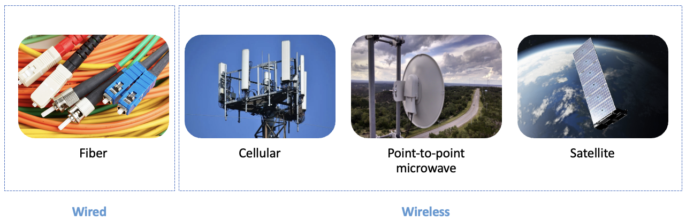

# Model Integration Framework

The diagram below summarizes how the datasets are used by each model, and how the different models can be used together in an integrated way.

In the first step, the Proximity, Coverage, Demand, Visibility and Fiber Path models assess the feasibility of four technologies below.

_Figure. Technologies._

In the second step, the Cost and Technology Assignment models determine the optimal connectivity solution for each Point of Interest (POI).

_Figure. Integration between toolkit models._

