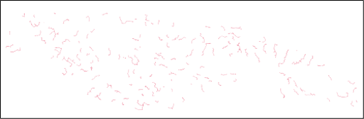
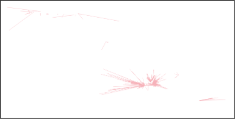

# Point-level results

## Output File Metadata

| Analysis Source | Indicator | Description |
|----------------|-----------|-------------|
| **Input POI data** | `dataset_id` | Identifier for the source dataset containing this POI |
| | `geometry` | Geometric representation of POI location (point coordinates) |
| | `lat` | Latitude coordinate of the POI location |
| | `lon` | Longitude coordinate of the POI location |
| | `poi_id` | Unique identifier for each Point of Interest (POI) |
| | `poi_type` | Category/type of POI (e.g. school, health center, town hall) |
| **Proximity** | `2g_cell_site_dist` | Distance in meters to nearest 2G cell site |
| | `3g_cell_site_dist` | Distance in meters to nearest 3G cell site |
| | `4g_cell_site_dist` | Distance in meters to nearest 4G cell site |
| | `5g_cell_site_dist` | Distance in meters to nearest 5G cell site |
| | `cell_site_dist` | Distance in meters to nearest cellular tower (any generation) |
| | `fiber_node_dist` | Distance in meters to nearest fiber optic network node |
| | `transmission_node_dist` | Distance in meters to nearest transmission infrastructure node |
| **Coverage** | `2g_mobile_coverage` | Boolean indicating if POI has 2G mobile network coverage |
| | `3g_mobile_coverage` | Boolean indicating if POI has 3G mobile network coverage |
| | `4g_mobile_coverage` | Boolean indicating if POI has 4G mobile network coverage |
| | `5g_mobile_coverage` | Boolean indicating if POI has 5G mobile network coverage |
| **Demand** | `mbps_demand_per_user` | Bandwidth demand per individual user in Mbps |
| | `number_of_users` | Estimated number of internet users at this POI |
| | `poi_count_10km` | Number of other POIs within 10km radius |
| | `poi_count_1km` | Number of other POIs within 1km radius |
| | `poi_count_2km` | Number of other POIs within 2km radius |
| | `poi_count_3km` | Number of other POIs within 3km radius |
| | `poi_count_4km` | Number of other POIs within 4km radius |
| | `poi_count_5km` | Number of other POIs within 5km radius |
| | `pop_within_10km` | Population count within 10km buffer around POI |
| | `pop_within_1km` | Population count within 1km buffer around POI |
| | `pop_within_3km` | Population count within 3km buffer around POI |
| | `pop_within_4km` | Population count within 4km buffer around POI |
| | `pop_within_5km` | Population count within 5km buffer around POI |
| | `total_mbps` | Total bandwidth demand in Mbps for this POI |
| **Fiber Path** | `closest_node_distance` | Distance in meters to the closest fiber node |
| | `closest_node_id` | Identifier of the nearest fiber node |
| | `connected_node_dist` | Distance in meters to the connected fiber node |
| | `connected_node_id` | Identifier of the node this POI is connected to |
| | `fiber_path` | Route description for fiber optic connection to this POI |
| | `fiber_path_incl_poi` | Fiber connection path including this POI in the route |
| | `fiber_path_order` | Order/sequence number of this POI in the fiber deployment path |
| | `in_mst_solution` | Boolean indicating if POI is included in fiber path solution |
| | `max_dist_km` | Maximum allowable distance in km for fiber path solution |
| | `n_conns` | Number of network connections associated with this POI |
| | `upstream_node_distance` | Distance in meters to the upstream fiber node |
| | `upstream_node_id` | Identifier of the upstream network node in the connection path |
| **Visibility** | `antenna_los_distance` | Line-of-sight distance in meters for antenna/radio connections |
| | `azimuth_angle` | Directional angle in degrees for point-to-point radio links |
| | `is_visible` | Boolean indicating if POI has line-of-sight to cellular infrastructure |
| | `is_visible_pois` | Boolean indicating if this POI is visible to other POIs |
| | `num_visible` | Count of visible cellular sites from this POI location |
| | `vis_geometry` | Geometric representation of visibility analysis |
| | `visible_cell_site_dist` | Distance in meters to the nearest visible cellular site |
| | `visible_cell_site_ict_id` | ID of the nearest visible cellular tower/base station |
| | `visible_cell_site_radio_type` | Type of radio technology at the nearest visible cell site |
| | `visible_pois` | List of other POIs visible from this location |
| **Technology Assignment** | `fiber_feasible` | Whether fiber is feasible for this POI |
| | `number_of_periods` | Total number of time periods for the connection |
| | `p2area_feasible` | Whether p2area is feasible for this POI |
| | `p2p_feasible` | Whether p2p is feasible for this POI |
| | `satellite_feasible` | Whether satellite is feasible for this POI |
| | `technology` | Selected connectivity technology solution for this POI |
| **Cost** | `annual_cost` | Annual cost of ownership (CAPEX and OPEX) |
| | `annual_revenue` | Annual operator revenue from ISP retail fees |
| | `init_capex` | Initial capital expenditure |
| | `pp_coo` | Total cost of ownership (CAPEX and OPEX) over project period |
| | `pp_profit` | Operator profits over project period (ISP retail fees minus cost of ownership) |
| | `pp_revenue` | Operator revenue over project period (ISP retail fees) |

# Fiber Path Edge-level results

## Output File Metadata

| Analysis Source | Indicator | Description |
|----------------|-----------|-------------|
| **Fiber Path** | `index` | Sequential row identifier for each road network edge/segment |
| | `u` | Source node identifier (starting point of road segment) |
| | `v` | Target node identifier (ending point of road segment) |
| | `key` | Unique key identifier for parallel edges between same nodes |
| | `osmid` | OpenStreetMap identifier for the original road segment |
| | `geometry` | Geometric representation of the road segment (linestring coordinates) |
| | `cluster` | Geographical cluster identifier for regional analysis grouping |

# Visibility Edge-level results

## Output File Metadata

| Analysis Source | Indicator | Description |
|----------------|-----------|-------------|
| **Visibility** | `poi_id` | Unique identifier for the Point of Interest being analyzed |
| | `is_visible` | Boolean indicating if clear line-of-sight exists between POI and at least one cell site |
| | `num_visible` | Total count of cell sites visible from this POI location |
| | `visible_cell_site_ict_id` | Identifier of the visible cell site |
| | `visible_cell_site_radio_type` | Type of radio technology at the visible cell site (e.g., 4G, 5G) |
| | `visible_cell_site_dist` | Straight-line ground distance between POI and visible cell site in meters (2D) |
| | `antenna_los_distance` | Straight-line distance between POI and cell site antenna in meters (3D) |
| | `azimuth_angle` | Directional bearing angle in degrees from POI to cell site |
| | `is_visible_pois` | Boolean indicating if other POIs are visible from this POI |
| | `visible_pois` | Array of POI identifiers that are visible from this POI location |
| | `geometry` | LineString geometry representing the line-of-sight path between POI and cell site |