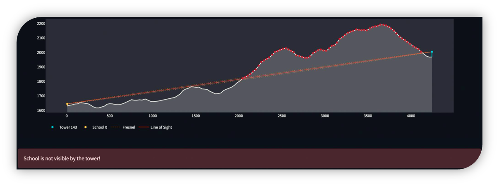

# Visibility

The Visibility module provides tools to analyze line-of-sight connectivity between different infrastructure components. It determines whether points of interest (POIs) have clear line-of-sight with cell sites or with other POIs, accounting for terrain elevation, Earth's curvature, and antenna heights. Line-of-sight is required to establish the feasibility of radio links between points of interest (POIs) and cell sites using visibility analysis. The analysis uses open topography data from the [Shuttle Radar Topography Mission](https://www.earthdata.nasa.gov/data/instruments/srtm) (SRTM), which provides 30-meter resolution elevation data.

_Figure: Visible cell site_


_Figure: Obstructed cell site_



**Key Features:**

- Line-of-sight analysis between points considering terrain elevation (SRTM data)
- Earth curvature and atmospheric refraction modeling
- Configurable search radius and antenna heights
- Support for different cellular radio types (2G, 3G, 4G, 5G)
- Detailed results including visibility status, distances, and azimuth angles

# Base Class: Visibility

The `Visibility` class serves as the foundation for visibility analyses.

## Class Parameters

| Parameter | Type | Default | Description |
|-----------|------|---------|-------------|
| points_of_interest | `PointOfInterestCollection` | Required | Collection of points of interest |
| cell_sites | `CellSiteCollection` | None | Collection of cell sites |
| srtm_data_handler | `SRTMDataHandler` | None | Handler for SRTM elevation data |
| search_radius | `int` | 35 | Maximum distance (km) to search for visibility |
| num_visible | `int` | 3 | Number of visible sites/POIs to find |
| poi_antenna_height | `float` | 15 | Antenna height at POI locations (meters) |
| allowed_radio_types | `list` | ['unknown', '2G', '3G', '4G', '5G'] | Radio types to include |
| earth_radius | `float` | 6371 | Earth radius in kilometers |
| refraction_coef | `float` | 0 | Atmospheric refraction coefficient |
| use_srtm | bool | `True` | Whether to use SRTM elevation data |
| logger | Logger | `None` | Logger instance |

## Class Attributes

| Attribute | Type | Description |
|-----------|------|-------------|
| points_of_interest | `PointOfInterestCollection` | Collection of points of interest |
| cell_sites | `CellSiteCollection` | Collection of cell sites |
| srtm_data_handler | `SRTMDataHandler` | Handler for SRTM elevation data |
| search_radius | `int` | Maximum search distance in meters |
| analysis_param | `dict` | Parameters used for the analysis |
| analysis_stats | `dict` | Statistics about the analysis run |
| logger | `Logger` | Logger instance for the class |

## Methods

| Method | Return Type | Description |
|--------|-------------|-------------|
| `retrieve_srtm_data_files()` | `None` | Downloads required SRTM elevation data |
| `get_antenna_height(point)` | `float` | Gets antenna height for a point |
| `check_visibility(source, target, use_srtm, srtm_collection, search_radius)` | `tuple` | Determines if target is visible from source considering terrain |

# VisibilityCell: Cell Sites Visible from POIs

## Class Attributes

| Attribute | Type | Description |
|-----------|------|-------------|
| analysis_results | `dict` | Dictionary storing analysis results per POI |
| analysis_stats | `dict` | Statistics about the analysis run |
| analysis_param | `dict` | Parameters used for the analysis |

## Methods

| Method | Return Type | Description |
|--------|-------------|-------------|
| `perform_analysis()` | `None` | Executes visibility analysis, finding visible cell sites for each POI |
| `get_results_table()` | `DataFrame` | Returns formatted results with detailed visibility information |
| `get_storage_table()` | `DataFrame` | Returns raw analysis results as a DataFrame |
| `format_analysis_summary()` | `str` | Returns a human-readable summary of analysis statistics |
| `retrieve_srtm_data_files()` | `None` | Downloads required SRTM elevation data |
| `check_visibility()` | `tuple` | Determines if target is visible from source considering terrain |

# VisibilityPOI: Points of Interest Visible to Each Other

## Class Attributes

| Attribute | Type | Description |
|-----------|------|-------------|
| analysis_results |`DataFrame` | DataFrame storing source-target pairs with visibility status |

## Methods

| Method | Return Type | Description |
|--------|-------------|-------------|
| `perform_analysis()` | `None` | Computes visibility between all pairs of POIs |
| `get_results_table()` | `DataFrame` | Returns a symmetrically formatted visibility graph |
| `retrieve_srtm_data_files()` | `None` | Downloads required SRTM elevation data |
| `check_visibility()` | `tuple` | Determines if target is visible from source considering terrain |

# Example

```python
import pandas as pd
from giga_inframapkit.entities.pointofinterest import PointOfInterestCollection
from giga_inframapkit.entities.cellsite import CellSiteCollection
from giga_inframapkit.handlers.srtmdatahandler import SRTMDataHandler
from giga_inframapkit.visibility.visibility import VisibilityCell, VisibilityPOI

# 1. Set up your data collections

poi_df = pd.read_csv("input/points_of_interest.csv") 
poi_collection = PointOfInterestCollection() 
poi_collection.load_from_records(poi_df.to_dict('records'))

# PointOfInterestCollection: 104 entities

cell_site_df = pd.read_csv("input/cell_sites.csv") 
cell_site_collection = CellSiteCollection() 
cell_site_collection.load_from_records(cell_site_df.to_dict('records'))

# CellSiteCollection: 34 entities

# 2. Set up the elevation data handler, that downloads a raster file with elevation data into the data_dir

srtm_data_handler = SRTMDataHandler(srtm_directory=f'/input/srtm1', logger=None)

# 3. Perform POI to cell site visibility

visibility_cellsites = VisibilityCell(
    points_of_interest=poi_collection,
    cell_sites=cell_site_collection,
    srtm_data_handler=srtm_data_handler,
    search_radius=35,
    num_visible=3,
    poi_antenna_height=25,
    allowed_radio_types=["4G", "5G"],
    earth_radius=6371,
    refraction_coef=0,
    logger=None
)

visibility_cellsites.perform_analysis()

# INFO:visibility_STP:Locating SRTM data files...
# INFO:visibility_STP:0 data file(s) to download.
# INFO:visibility_STP:Downloading SRTM data files...
# INFO:visibility_STP:Fetching from ITU public storage
# INFO:visibility_STP:Filelist specified, downloading only selected files
# INFO:visibility_STP:Downloaded completed
# INFO:visibility_STP:Using 8 processes for parallel computation
# INFO:visibility_STP:Processing 104 points of interest
# INFO:visibility_STP:Checking cell site visibility:   0%|          | 0/104 [00:00<?, ?it/s]
# INFO:visibility_STP:Checking cell site visibility:   1%|          | 1/104 [00:02<03:46,  2.20s/it]
# INFO:visibility_STP:Checking cell site visibility:  18%|#8        | 19/104 [00:02<00:08,  9.85it/s]
# INFO:visibility_STP:Checking cell site visibility:  36%|###5      | 37/104 [00:02<00:03, 19.56it/s]
# INFO:visibility_STP:Checking cell site visibility: 100%|##########| 104/104 [00:02<00:00, 35.79it/s]
# Visibility Analysis Summary:
# Number of points of interest: 104
# Number of cell sites: 34
# Total visibility checks performed: 1803
# Average visibility checks per point of interest: 17.34
# Time taken for SRTM data download: 0.11 seconds
# Time taken for analysis: 3.0 seconds
# Total time elapsed: 3.11 seconds

cellsites_results_table = visibility_cellsites.get_results_table()

cellsites_results_table.head()

# poi_id	ict_id	radio_type	ground_distance	antenna_los_distance	azimuth_angle	geometry	is_visible	num_visible	order
# 0	be6dc17a-57df-4709-bff1-18f433f7df71	4381fb37-07f8-465a-a654-6bc8df169be0	4G	269	269	211.41	LINESTRING (6.7332108 0.3300316, 6.73195 0.327...	True	3	1
# 1	be6dc17a-57df-4709-bff1-18f433f7df71	7c4d5ac9-c381-485e-9c3f-99fbb062c837	4G	815	815	353.02	LINESTRING (6.7332108 0.3300316, 6.732319444 0...	True	3	2
# 2	be6dc17a-57df-4709-bff1-18f433f7df71	cb6229b5-b934-4d5f-a7c1-39f33e1b1d6f	4G	881	881	77.87	LINESTRING (6.7332108 0.3300316, 6.740961111 0...	True	3	3
# 3	7f4bf645-3665-4658-9913-edcb3fba3b2d	226b6f88-aac8-41af-8c88-6fd30b561afa	4G	683	683	21.55	LINESTRING (6.7235979 0.3330804, 6.725855556 0...	True	3	1
# 4	7f4bf645-3665-4658-9913-edcb3fba3b2d	b4fbe775-c7e9-4752-b21c-883b84ea08ad	4G	867	869	257.62	LINESTRING (6.7235979 0.3330804, 6.715980556 0...	True	3	2

# 4. Perform POI to POI visibility

visibility_pois = VisibilityPOI(
    points_of_interest=poi_collection, 
    cell_sites=cell_site_collection, 
    srtm_data_handler = srtm_data_handler,
    search_radius = 35,
    poi_antenna_height = 25,
    earth_radius = 6371,
    refraction_coef = 0,
    logger = None
    )

visibility_pois.perform_analysis()

# INFO:visibility_STP:Locating SRTM data files...
# INFO:visibility_STP:0 data file(s) to download.
# INFO:visibility_STP:Downloading SRTM data files...
# INFO:visibility_STP:Fetching from ITU public storage
# INFO:visibility_STP:Filelist specified, downloading only selected files
# INFO:visibility_STP:Downloaded completed
# INFO:visibility_STP:Using 8 processes for parallel computation
# INFO:visibility_STP:Processing 5356 POI pairs
# INFO:visibility_STP:Checking POI-to-POI visibility:   0%|          | 0/5356 [00:00<?, ?it/s]
# INFO:visibility_STP:Checking POI-to-POI visibility:   0%|          | 1/5356 [00:03<4:55:26,  3.31s/it]
# INFO:visibility_STP:Checking POI-to-POI visibility:   6%|6         | 335/5356 [00:03<00:37, 135.50it/s]
# INFO:visibility_STP:Checking POI-to-POI visibility:  19%|#8        | 1003/5356 [00:03<00:10, 417.91it/s]
# INFO:visibility_STP:Checking POI-to-POI visibility:  50%|####9     | 2673/5356 [00:05<00:03, 842.69it/s]
# INFO:visibility_STP:Checking POI-to-POI visibility:  56%|#####6    | 3007/5356 [00:05<00:02, 903.04it/s]
# INFO:visibility_STP:Checking POI-to-POI visibility: 100%|##########| 5356/5356 [00:05<00:00, 999.95it/s]
# INFO:visibility_STP:Analysis completed in 5.57 seconds

pois_results_table = visibility_pois.get_results_table()

pois_results_table.head()

# poi_id	visible_pois	is_visible_pois
# 0	09b90515-0ecc-4992-9d39-ae208e1c1fea	[1d24a1c9-9d48-4ea0-9aa3-cfdb65d228a1]	True
# 1	0c16c2e8-db92-411b-a6f7-535fb1810e34	[967c9f47-5162-4f1b-aaa2-a7d77279d40c, 1e83e05...	True
# 2	1205e5ef-5d91-47b7-8fc0-11ef019263e5	[c77898fa-9377-4552-b2a1-c719f3257dbf, 76d2158...	True
# 3	1534adf8-b45c-443b-8e1d-87a504e6dc64	[82e467a9-50d8-407f-aa3a-58b68297b55b, 6dda061...	True
# 4	192c1704-9e7e-4b7a-8ba7-0eed5ae771ad	[26ac2dc1-98e0-4ce7-8c1f-c6935b90ecc4, aeb454b...	True
```